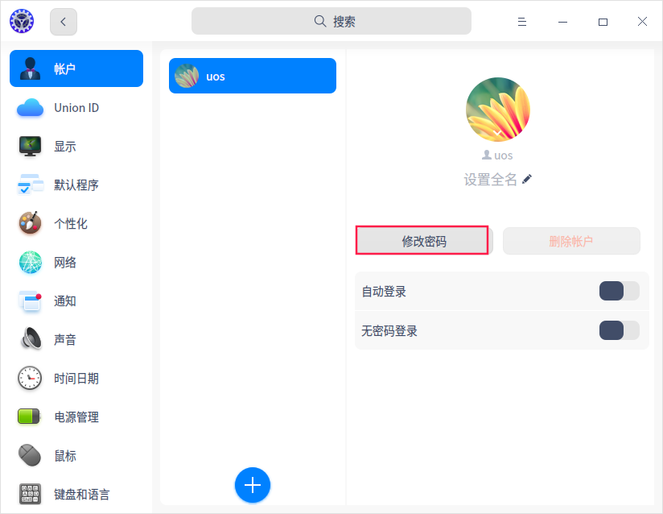

source: `{{ page.path }}`

# 了解安全性

## 管理Cookie和其他网站数据

通过浏览器可以对Cookie进行设置，删除现有 Cookie、允许/阻止所有 Cookie，以及对某些网站进行偏好设置。

Cookie 是访问的网站所创建的文件。Cookie 通过保存浏览信息来让您获得更轻松的在线体验。借助 Cookie，网站可使您保持登录状态、记住您的网站偏好设置，并为您提供本地的相关内容。

#### 删除 Cookie

如果删除 Cookie，即会退出相应网站，已保存的偏好设置可能也会随之删除。

1. 在浏览器窗口，单击    > **设置 **。
2. 在“隐私和安全”区域，单击"网站设置"旁边的更多图标 /browser/zh_CN/icon/arrow_right_light.svg)，进入“内容设置”窗口。
3. 在 **Cookie** 下方，单击 **所有Cookie和网站数据...**，弹出“Cookie和网站数据”窗口。
   - 删除特定Cookie和网站数据：搜索Cookie和网站数据的名称，在该网站的网址右侧单击 。
   - 删除所有的Cookie和网站数据：单击 **全部删除**。

您还可以删除某个时间段内的 Cookie和网站数据。

1. 在浏览器窗口，单击    > **更多工具 ** > **清除浏览数据**。
2. 在“清除历史记录”窗口，单击“清除这段时间的数据”旁边的下拉菜单，选择一个时间段，如 **过去一小时**或**过去一天**。
3. 勾选 **删除Cookie 和其他网站数据**，并取消选中所有其他项。
4. 单击 **清除**。

#### Cookie设置

1. 在浏览器窗口，单击    > **设置 **。
2. 在“隐私和安全”区域，单击"网站设置"旁边的更多图标 /browser/zh_CN/icon/arrow_right_light.svg)，进入“内容设置”窗口。
3. 在Cookie下方，您可以选择以下某项设置：
   - **允许设置本地数据（推荐）**：默认设置。
   - **仅将本地数据保留到您退出浏览器为止**：在使用浏览器期间保存浏览器访问活动信息，但在退出浏览器后自动删除相应 Cookie。
   - **阻止网站设置任何数据**：阻止网站保存 Cookie，如果不允许网站保存 Cookie，您将无法浏览大部分需要登录的网站。
   - **阻止第三方Cookie和网站数据**：允许来自所访问网站的 Cookie，但阻止来自其他网站（这些网站拥有相应网页上显示的广告或图片）的 Cookie。
   - **阻止其他网站读取我的上网记录，保护隐私**：系统将会阻止来自其他网站的所有 Cookie 和网站数据，即使相应网站在您的例外情况列表中被设为“允许”也是如此。
4. 如果需要例外设置，可单击 **管理例外情况...**。输入对应网站地址，可选择**允许**、**退出时清除**、**禁止**选项，并以此设置为准。

## 更改或重置登录密码

1. 在统信UOS的启动器中，搜索并运行安全中心。在安全中心主界面，选择左侧导航栏的 **系统安全->登录安全**。进入登录安全界面，可以设置密码安全等级。

2. 在控制中心修改密码，或创建新用户设置密码时，若设置的密码不符合级别要求，会保存失败，您可以前往安全中心修改等级或重新设置密码。

   

## 打开或关闭防火墙

安全中心的防火墙开关主要控制应用联网及远程访问功能是否生效。

关闭：联网管控/远程访问管控功能都不生效。

开启：联网管控/远程访问管控功能生效。

## 病毒查杀

统信UOS中安全中心支持三种病毒扫描方式，分别为全盘扫描、快速扫描和自定义扫描，您可以任选一种方式进行病毒扫描。根据系统提示，定期更新病毒库。

## USB连接安全

1. 在安全中心主界面，选择左侧导航栏的 **系统安全->USB安全**。进入USB设置界面，开启 **保存USB存储设备连接记录** 开关，可以查看带存储功能的 USB 设备连接电脑的记录。

   

2. 还可以将常用的USB设备加入白名单，设置只允许白名单设备连接电脑，防止电脑数据泄露。

