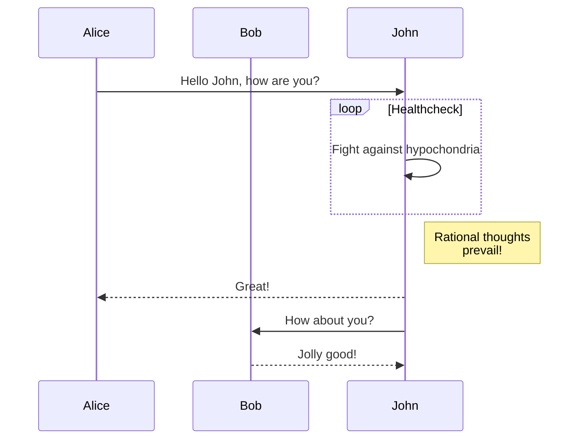
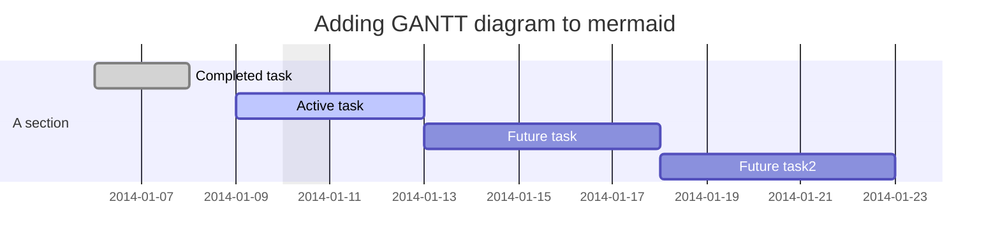
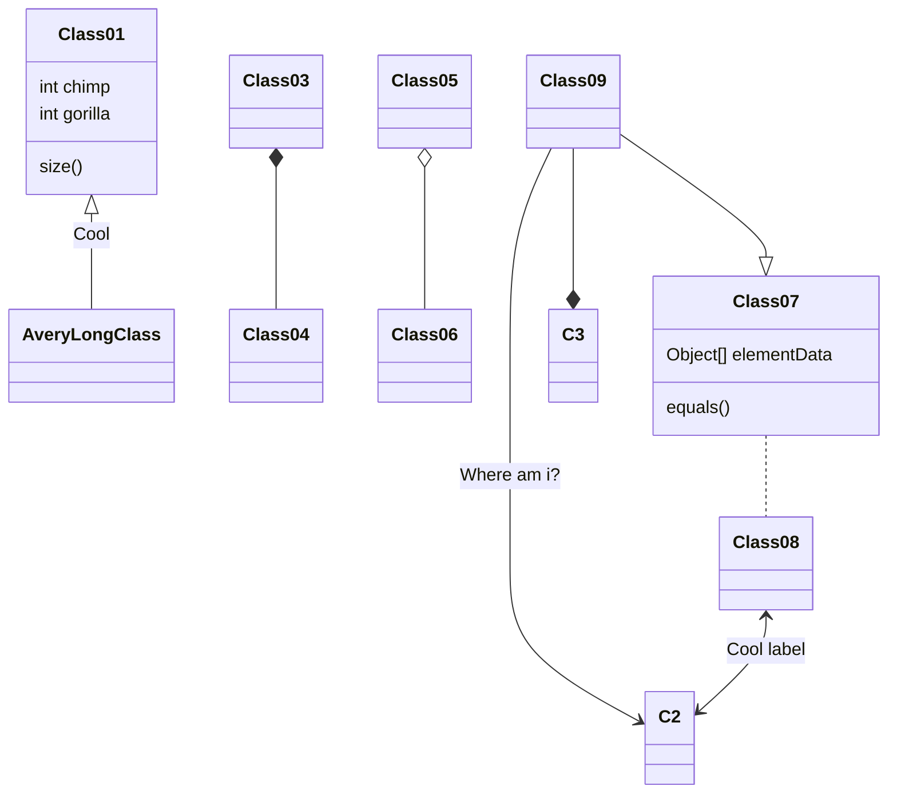

# ★〓本wiki编辑及使用方法〓★

```note
deepin用户手册文档目录上线GitHub，该项目由Jekyll wiki主题驱动！
```

## 1.项目介绍

**亲爱的深粉：（深度官方原文）**

 deepin文档目录已上线GitHub，目前包括deepin用户手册&deepin-FAQ。
 
 deepin用户手册，主要是deepin操作系统的一些使用介绍文档。目前我们已经上传了一些内容，包括系统基础支持、入门知识、基础模块功能使用介绍，大家可以了解学习，或者从这些或其他方面补充。

## 2.文档及排版要求

### 使用说明

该文档支持多层目录，目录名可为中文。每一层目录下建立一个`README.md`文档（格式要求见下方），在目录下建立你需要的`正式文档.md`(格式要求见下方)。

### （1）README.md文档格式：

文档头部格式必须为：
```


---
sort: 1
---

# 该级目录的标题



source: `{{ page.path }}`

这里你还可以写点你想的该目录分类的介绍。


```

参数`sort: 1`为目录或文档的排序顺序。

### （2）正式文档格式：

```


---
sort: 1
---

source: `{{ page.path }}`

# 你写的文档的标题

文档正文。。。。。。。


```
参数`sort: 1`为目录或文档的排序顺序，不使用该参数，文档较多时，显示不清楚层次。

### （3）插入带 Jekyll 语法的html代码格式：

本来 Markdown 用来插入 HTML 代码是没有问题的，但是 Jekyll 语法内容直接在文中的任何地方都会被转换，所以也只能借助 Jekyll 语法来解决这一问题。比如，原本的变量：

```

{{ post.date }}

```
实质上在其左侧插入了{ % raw % }，在其右侧插入了{ % endraw % }。**注意，使用时花括号与百分号之间无空格，该段中为不使其转换，添加了空格**。如果你有大段代码需要应用，只需要把它们分别加到整个块的两端即可。

## 3.本项目使用jekyll-rtd-theme


### （1）快速部署

```yml
remote_theme: rundocs/jekyll-rtd-theme
```

You can [generate](https://github.com/rundocs/starter-slim/generate) with the same files and folders from [rundocs/starter-slim](https://github.com/rundocs/starter-slim/)

### （2）特色 

- 简码 (Toasts card(tip, note, warning, danger), mermaid(流程图，时序图，甘特图，类图等))
- 页面插件 (emoji, gist, avatar, mentions)
- 自动生成侧边栏
- [属性列表定义](https://kramdown.gettalong.org/syntax.html#attribute-list-definitions) (Primer/css utilities, Font Awesome 4)
- Service worker (caches)
- SEO (404, robots.txt, sitemap.xml)
- Canonical Link (Open Graph, Twitter Card, Schema data)

简码示例：

吐司卡Toasts card(tip, note, warning, danger)：

```note
deepin用户手册文档目录上线GitHub，该项目由Jekyll wiki主题驱动！
```
```tip
deepin用户手册文档目录上线GitHub，该项目由Jekyll wiki主题驱动！
```
```danger
deepin用户手册文档目录上线GitHub，该项目由Jekyll wiki主题驱动！
```
```warning
deepin用户手册文档目录上线GitHub，该项目由Jekyll wiki主题驱动！
```

美人鱼mermaid(流程图，时序图，甘特图，类图等)：








## （3）可选参数

| name          | default value        | description       |
| ------------- | -------------------- | ----------------- |
| `title`       | repo name            |                   |
| `description` | repo description     |                   |
| `url`         | user domain or cname |                   |
| `baseurl`     | repo name            |                   |
| `lang`        | `en`                 |                   |
| `direction`   | `auto`               | `ltr` or `rtl`    |
| `highlighter` | `rouge`              | Cannot be changed |

```yml
# folders sort
readme_index:
  with_frontmatter: true

meta:
  key1: value1
  key2: value2
  .
  .
  .

google:
  gtag:
  adsense:

mathjax: # this will prased to json, default: {}

mermaid:
  custom:     # mermaid link
  initialize: # this will prased to json, default: {}

scss:   # also _includes/extra/styles.scss
script: # also _includes/extra/script.js

translate:
  # shortcodes
  danger:
  note:
  tip:
  warning:
  # 404
  not_found:
  # copyright
  revision:
  # search
  searching:
  search:
  search_docs:
  search_results:
  search_results_found: # the "#" in this translate will replaced with results size!
  search_results_not_found:

plugins:
  - jemoji
  - jekyll-avatar
  - jekyll-mentions
```

## The license

The theme is available as open source under the terms of the MIT License

The theme is inspired by [sphinx-rtd-theme](https://github.com/readthedocs/sphinx_rtd_theme) and [jekyll-rtd-theme](https://github.com/rundocs/jekyll-rtd-theme).
